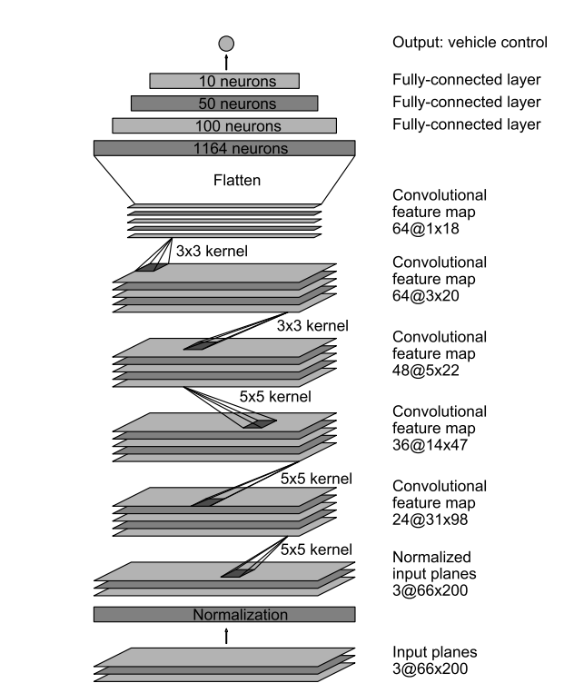
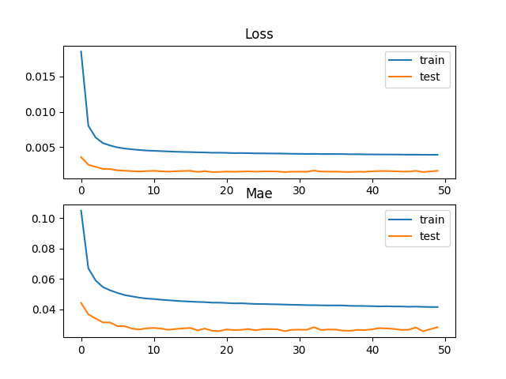

The work of https://github.com/asap-report/carla is used as a starting point.This repository has been forked from the same.
The code of the project is at https://github.com/aravind93raja/carla/tree/Myproject/PythonClient/Myproject.

Goals of the Project are 4 fold :

1)To simulate the Track following capabilities of a PID Based Controller. 

( Done )  CODE: PIDControl_DataCollection.py

2)To collect Dataset of Depth Iamges and and Steering values for training on a Neural Network. 

( Done )  CODE: PIDControl_DataCollection.py

3)To Train a Neural Network based on [Nvidia's End to End Learning for Self-Driving Cars](https://images.nvidia.com/content/tegra/automotive/images/2016/solutions/pdf/end-to-end-dl-using-px.pdf "Nvidia's End to End Learning for Self-Driving Cars")  with Depth Images instead of RGB Images for prediction of Steering Values.

( Done )

4)To Implement and Simulate Error state Extended Kalman Filter 

(In Progress ) Ground Work on my other repository :https://github.com/aravind93raja/State-Estimation-and-Localization

__________________________________________________________________________________________________________________________

Results and Discussion : 

Task 1 & 2 : **_PID Control_**

The results of the simulation can be viewed in the following video : 

Task 3 : **_Training a Neural Network & Lateral Controller based on the same _**

*The same Neural Network Architecture of [Nvidia's End to End Learning for Self-Driving Cars](https://images.nvidia.com/content/tegra/automotive/images/2016/solutions/pdf/end-to-end-dl-using-px.pdf "Nvidia's End to End Learning for Self-Driving Cars") was used.

*Instead of 3 channel RGB Images ,Single Depth Channel Images were used in this Architecture.

*Since the goal at hand was to predict Steering Values , A regression problem , Adam algorith was used as optimizer and Mean Absolute Error was used as a metric

__________________________________________________________________________________________________________________________
model.compile(loss='mse',optimizer=Adam(1e-5),metrics=['mae'])
__________________________________________________________________________________________________________________________

*A Callback function to save the model with better Mean Absolute Error at any epoch was written.

__________________________________________________________________________________________________________________________
checkpoint = ModelCheckpoint(filepath, monitor='val_mae', verbose=1, save_best_only=True, mode='min')
__________________________________________________________________________________________________________________________

*After tweaking of Hyperparameters ,This is how the training went

*The model with the lowest Mean_Absolute_Error 0.02545 was chosen to program the Neural Network Controller

The results of the Neural Network controller validated the training on unseen racetrack.It was able to sucessfully turn through each and every bend.

The results are shown in this Video montage below.

*Other Details to be updated soon**
